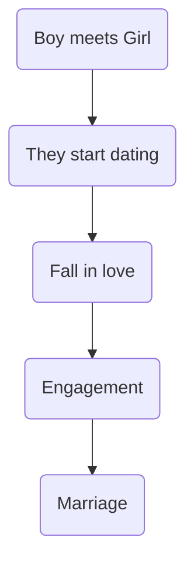
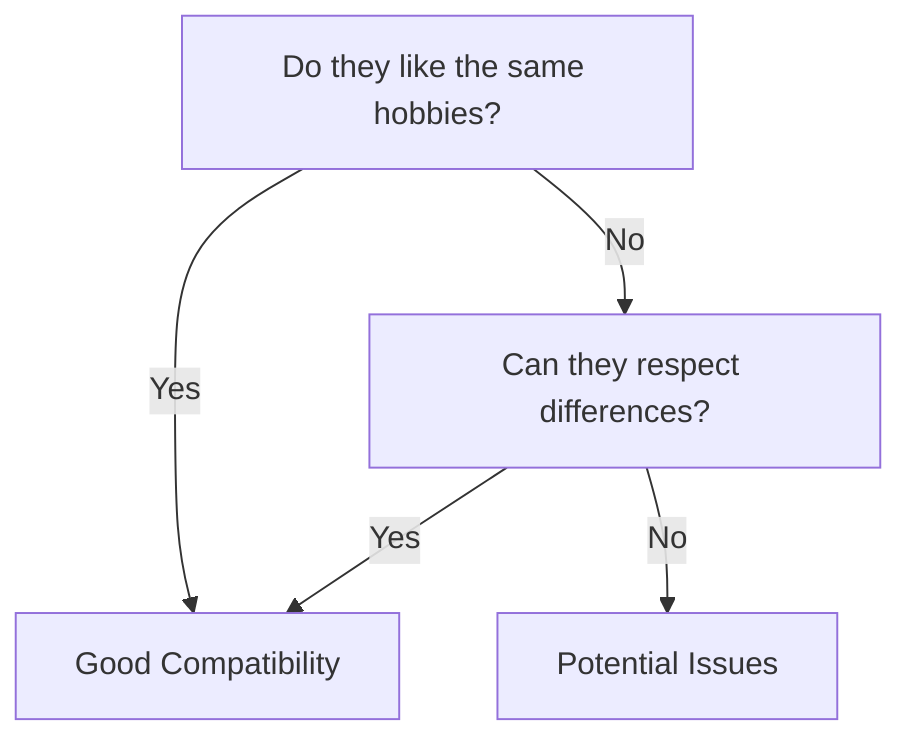
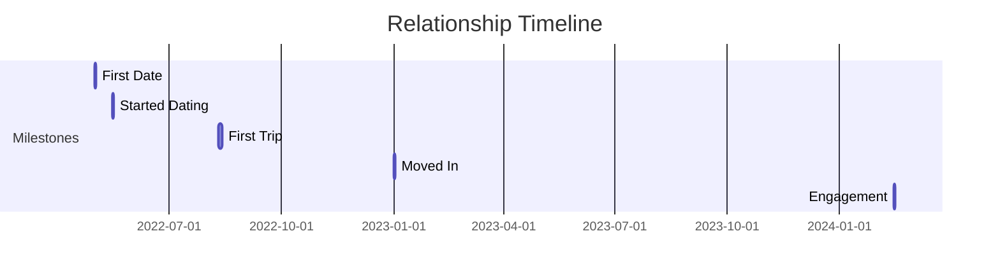
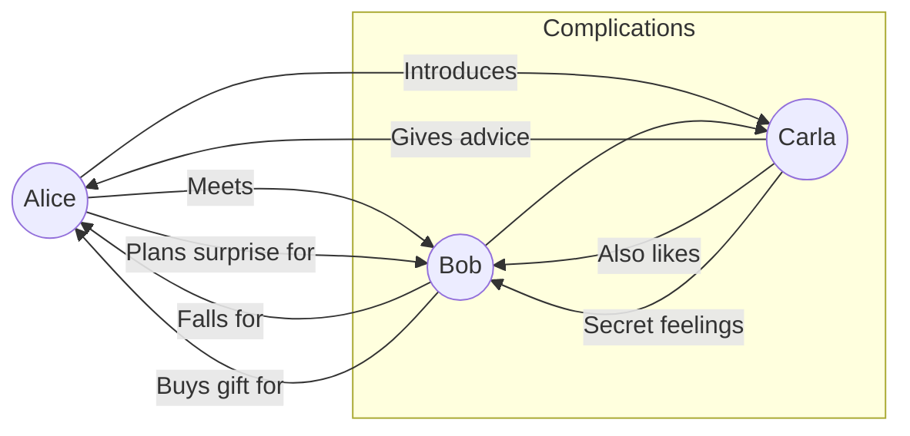
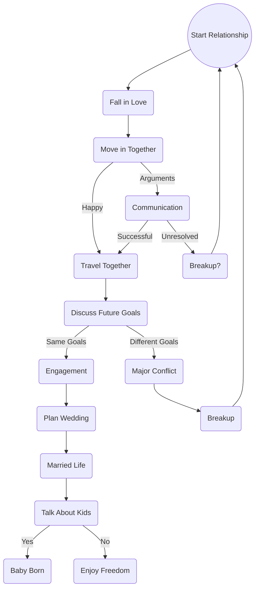

## 😲 md-editor-rt

Markdown Editor for React, developed in jsx and typescript, support different themes、beautify content by prettier.

### 🤖 Base

**bold**, <u>underline</u>, _italic_, ~~line-through~~, superscript^26^, subscript~1~, `inline code`, [link](https://github.com/imzbf)

> quote: I Have a Dream

1. So even though we face the difficulties of today and tomorrow, I still have a dream.
2. It is a dream deeply rooted in the American dream.
3. I have a dream that one day this nation will rise up.

- [ ] Friday
- [ ] Saturday
- [x] Sunday

## Marks

==Color== =q=Color== =e=Color== =r=Color== =t=Color== =u=Color== =i=Color== =o=Color== =p=Color== =a=Color== =s=Color== =d=Color== =f=Color== =g=Color== =h=Color== =j=Color== =k=Color== =l=Color== =z=Color== =x=Color== =c=Color== =v=Color== =b=Color== =n=Color== =m=Color==

## 🤗 Demo

```js
import { defineComponent, ref } from "vue";
import { MdEditor } from "md-editor-rt";
import "md-editor-rt/lib/style.css";

export default defineComponent({
  name: "MdEditor",
  setup() {
    const text = ref("");
    return () => (
      <MdEditor
        modelValue={text.value}
        onChange={(v: string) => (text.value = v)}
      />
    );
  },
});
```

## 🖨 Text

The Old Man and the Sea served to reinvigorate Hemingway's literary reputation and prompted a reexamination of his entire body of work.

## 📈 Table

| THead1          |      THead2       |           THead3 |
| :-------------- | :---------------: | ---------------: |
| text-align:left | text-align:center | text-align:right |

## 📏 Formula

Inline: $x+y^{2x}$

$$
\sqrt[3]{x}
$$

## 🪄 Alert

> [!NOTE]
> Useful information that users should know, even when skimming content.

> [!TIP]
> Helpful advice for doing things better or more easily.

> [!IMPORTANT]
> Key information users need to know to achieve their goal.

> [!WARNING]
> Urgent info that needs immediate user attention to avoid problems.

> [!CAUTION]
> Advises about risks or negative outcomes of certain actions.

## Embeds

##### Youtube

- Video
  https://www.youtube.com/watch?v=Kk1vR7BdTno
- Short
  https://www.youtube.com/shorts/_hFKxXG_SrY

##### Twitter/X

- Post
  https://x.com/NASA/status/1935033453424132117

##### Instagram

- Account
  https://www.instagram.com/nasa/
- Post
  https://www.instagram.com/p/DJuVfuGz_TV/
- Reel
  https://www.instagram.com/reel/DKznjJktlFG/

##### 3Speak

- Video
  https://3speak.tv/watch?v=mipiano/zylokfgv

## Links

- Internal
  @guest4test1 @barddev
  #hive #dev

- Good domain
  https://ecency.com
  https://peakd.com

- Unknow domain
  https://www.nasa.gov

- Bad domain

## Images


# Couple Relationship Graphs – Mermaid Examples

## Simple Relationship Flow (Basic Flowchart)



---

## Compatibility Comparison (Decision Tree)



---

## Timeline of Relationship (Gantt Style)



---

## Love Story Network (Complex Graph)



---

## Life Decisions as a Couple (Large Flow)


